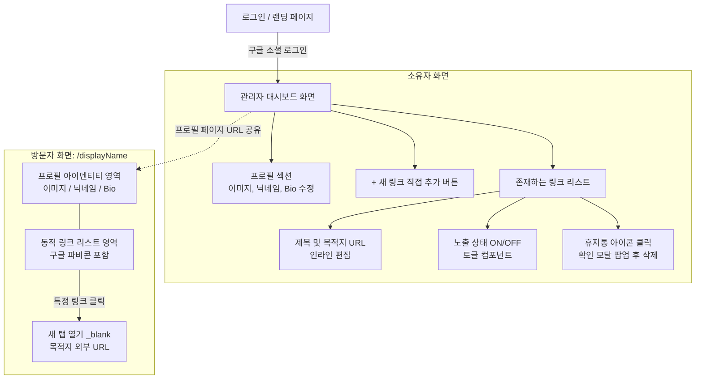

# 마이링크 (My Link) 와이어프레임 (Wireframe)

본 문서는 마이링크 서비스의 주요 화면인 **방문자용 퍼블릭 프로필**과 **소유자용 관리자 대시보드**의 구조를 정의합니다.

## 1. 화면 흐름도 및 구조 (Mermaid)

서비스의 전체적인 화면 이동 흐름과 기능별 화면 구조도입니다.



## 2. 화면 목업 - 방문자 뷰 (ASCII Art)

모바일 기기의 세로 화면 비율에 최적화된 방문자용 프로필 화면입니다. 콘텐츠에 집중할 수 있도록 중앙 정렬(Center Aligned) 디자인을 채택합니다.

```text
+-----------------------------------------+
|                                         |
|                                         |
|              [ Profile ]                |
|              [  Image  ]                |
|                                         |
|        @displayName (Nickname)          |
|                                         |
|    "소개글(Bio)이 이곳에 표시됩니다."   |
|                                         |
|                                         |
|   +---------------------------------+   |
|   |  [Icon] Personal Website        |   |
|   +---------------------------------+   |
|                                         |
|   +---------------------------------+   |
|   |  [Icon] Instagram Profile       |   |
|   +---------------------------------+   |
|                                         |
|   +---------------------------------+   |
|   |  [Icon] GitHub Repository       |   |
|   +---------------------------------+   |
|                                         |
|                                         |
|            Powered by MyLink            |
+-----------------------------------------+
```

## 3. 화면 목업 - 소유자 대시보드 뷰 (ASCII Art)

소유자가 구글 로그인 후 접근하는 대시보드 화면입니다. 모든 수정 작업은 추가 페이지 이동이나 모달 없이 인라인(Inline) 방식으로 제어됩니다.

```text
+---------------------------------------------------------+
| MyLink Admin        [공유하기]                  [로그아웃]|
+---------------------------------------------------------+
|                                                         |
|  +---------------------------------------------------+  |
|  | [Profile]  @displayName ✎ (클릭 시 인라인 수정)   |  |
|  | [ Image ]  "한 줄 소개(Bio)" ✎ (클릭 시 수정)     |  |
|  |  (수정)                                           |  |
|  +---------------------------------------------------+  |
|                                                         |
|  [ + 새 링크 추가하기 ]                                 |
|                                                         |
|  +---------------------------------------------------+  |
|  | ☰ [Icon] 제목(Title) ✎               [ O 토글 ON ]|  |
|  |           https://mywebsite.com ✎    [ 휴지통 🗑 ]|  |
|  +---------------------------------------------------+  |
|                                                         |
|  +---------------------------------------------------+  |
|  | ☰ [Icon] 인스타그램 ✎                [ X 토글 OFF]|  |
|  |           https://instagram.com ✎    [ 휴지통 🗑 ]|  |
|  +---------------------------------------------------+  |
|                                                         |
+---------------------------------------------------------+
```

> **UI Component 참고사항**
> - **인라인 수정 (✎ 표시)**: 해당 텍스트/영역을 마우스로 클릭하면 즉시 입력(Input) 폼으로 전환되어 수정이 가능합니다. 입력 후 포커스를 잃으면(onBlur) 즉시 저장됩니다.
> - **토글 스위치**: 직관적인 UI 요소로 활성화 상태를 표현하며, OFF 시 방문자 브라우저 뷰에서는 해당 리스트가 숨김 처리됩니다.
> - **휴지통**: 클릭 시 "정말 삭제하시겠습니까?" 컨펌 모달 팝업을 띄워 안전장치를 마련합니다.

